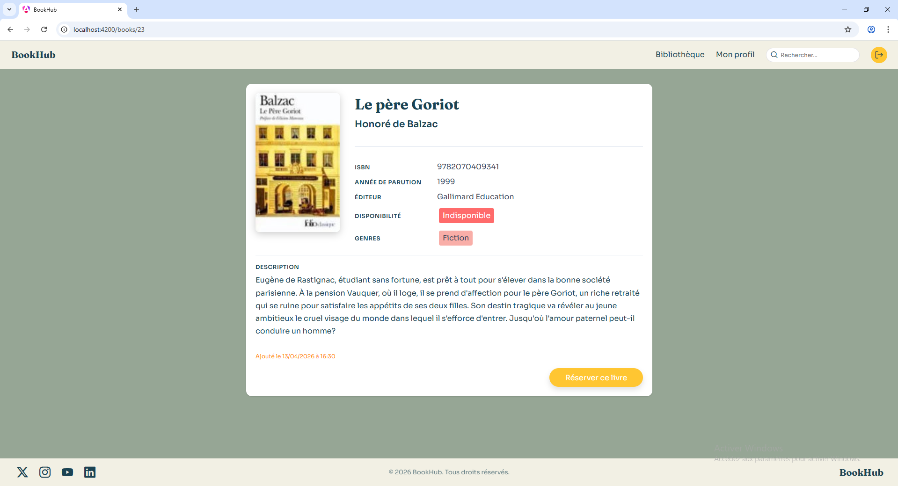
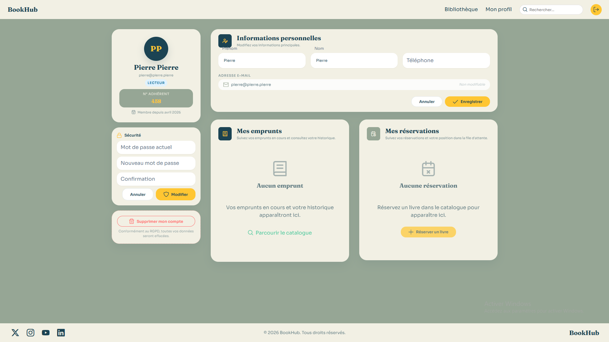

# 📚 BookHub – Plateforme de Gestion de Bibliothèque Communautaire

## 🧾 Présentation du projet

**BookHub** est une application web fullstack développée dans le cadre du projet CDA.
Elle permet à une bibliothèque communautaire de gérer efficacement son catalogue, ses emprunts et ses utilisateurs.

L’objectif est de remplacer un système manuel (papier) par une solution moderne, sécurisée et accessible en ligne.

### 🎯 Fonctionnalités principales

* 🔐 Authentification sécurisée (JWT)
* 📖 Consultation et recherche de livres
* 📚 Emprunt et retour de livres
* 📌 Réservation avec file d’attente
* ⭐ Notation et commentaires
* 📊 Tableaux de bord (lecteur, bibliothécaire, admin)

---

## ⚙️ Prérequis

Avant de lancer le projet, assurez-vous d’avoir installé :

* **Java** : version 17 ou supérieure
* **Spring Boot** : version 3.2 ou supérieure
* **Node.js** : version 18+
* **Angular** : version 17+
* **SQL Server** : 2019 ou supérieur
* **Gradle**
* **Git**

---

## 🛠️ Installation et configuration

### 1. Cloner le projet

```bash
git clone https://github.com/aflorent44/bookhub BookHub
cd BookHub
```

---

### 2. Configuration de la base de données

* Créer une base de données SQL Server :

```sql
CREATE DATABASE bookhub_db;
```

* Configurer le fichier `application.properties` (backend) :

```properties
spring.datasource.url=jdbc:sqlserver://localhost:1433;databaseName=bookhub_db
spring.datasource.username=YOUR_USERNAME
spring.datasource.password=YOUR_PASSWORD

spring.jpa.hibernate.ddl-auto=update
spring.jpa.show-sql=true
```

---

### 3. Configuration du backend (Spring Boot)

```bash
cd server
gradle build
```

---

### 4. Configuration du frontend (Angular)

```bash
cd web
npm install
```

---

## ▶️ Lancement de l'application

### Backend

```bash
cd server
gradlew bootrun
```

Le backend sera accessible sur :
👉 http://localhost:8080

---

### Frontend

```bash
cd web
ng serve
```

L'application sera accessible sur :
👉 http://localhost:4200

---

## 👤 Comptes de test

| Rôle      | Email                                           | Mot de passe |
| --------- | ----------------------------------------------- | ------------ |
| USER      | [user@test.com](mailto:user@test.com)           | Test123!     |
| LIBRARIAN | [librarian@test.com](mailto:librarian@test.com) | Test123!     |
| ADMIN     | [admin@test.com](mailto:admin@test.com)         | Test123!     |

---

## 📸 Captures d'écran

### 🏠 Page d'accueil


### 📚 Catalogue de livres

*(Ajouter une capture ici)*

### 📖 Détail d’un livre



### 📊 Dashboard utilisateur




---

## 🚀 Améliorations possibles

* Notifications pour les réservations et retards
* Système de recommandations
* Dimention communautaires
* Déploiement Docker

---

## 👨‍💻 Équipe

* BROSSEAU Océane
* FLORENT Amélie
* HUITRIC Pierre
* VINCENT Axel

---

## 📜 Licence

Projet réalisé dans un cadre pédagogique (CDA).
